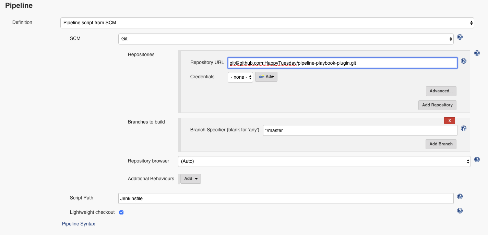
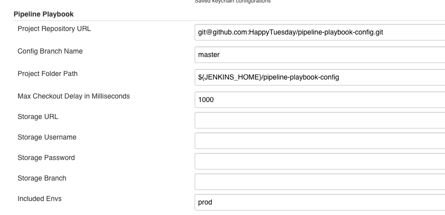

# pipeline-playbook 使用说明

## 开始使用

### 如何安装插件

1. 下载并安装Jenkins  
   参考Jenkins官方文档进行安装（https://jenkins.io/doc/pipeline/tour/getting-started/）
2. 在Jenkins插件管理页面安装pipeline相关的插件
3. 创建名为`pipeline-playbook-plugin-installer`的pipeline类型的Jenkins job，进入job的配置页面，并按照下图进行配置  
     
   注意：`Repository URL`应改为你的私有仓库代码地址
4. 执行刚刚创建的job `pipeline-playbook-plugin-installer`，执行期间Jenkins会自动重启，插件会在重启之后安装成功

### 配置插件

在Jenkins重启之后，请转到Jenkins的系统配置页面，找到`Pipeline Playbook`节，然后按照下图进行配置：



说明：
* Project Repository URL: 请填写你的playbook-config项目的地址
* Config Branch Name: playbook-config项目的分支
* Included Envs: 需要在此Jenkins上发版的环境名列表，用逗号隔开

### 编写并提交 playbook-config

playbook-config项目用来管理所有的环境、项目和剧本的定义。

从`git@github.com:HappyTuesday/pipeline-playbook-config.git`获取最新的playbook config模版，然后将其提交到你的私有仓库中。

在playbook-config中定义所有的环境、项目和剧本。

playbook-config各文件夹的解释如下：

* src/envs  
  环境定义，环境名为groovy脚本名称，可以包含子文件夹，此时环境名为`子文件夹名称.脚本名称`
* src/playbooks  
  剧本定义，剧本名为groovy脚本名，可以包含子文件夹，此时剧本名称为`子文件夹名称.脚本名`
* src/projects  
  项目定义，与环境或剧本不同，项目名称有两种格式，在src/projects文件夹下的每个子文件夹的名称（不包括路径）均为项目名称（自动定义的抽象项目）。
  每个子文件夹下的`$.groovy`为所属子文件夹对应项目的定义，其他名称的问价为普通类型项目的定义。
  
  除`$.groovy`之外，所有项目定义文件均使用`project`或`abstractProject`关键字定义项目，项目名称一般和这两个关键字后面的参数一致，但某些情况下不一致，详细信息请参考DSL语法规范。
* src/resources  
  资源文件的存放位置

请根据业务需求编写并维护此项目

### 创建用于自动生成Jenkins job的job-seed

Jenkins job `job-seed` 用于根据`playbook-config`代码中的内容自动生成相应的Jenkins Job。目前此Job需要手工创建，创建过程如下：

1. 创建名为`job-seed`的pipeline类型的job
2. 在`job-seed`的配置页面的*Pipeline*节中选择*Definition*为`Pipeline script`，并在新出现的`Script`脚本编辑器中输入如下内容：
   
   ```groovy
   node ("master") {
       generateJobs params
   }
   ```
3. 保存

在`job-seed`创建完成之后，请执行该job。如果job执行顺利，那么你定义的job会被自动创建出来。

如果需要在`playbook-config`代码变更的时候自动执行`job-seed`，请使用gitlab的webhook功能。